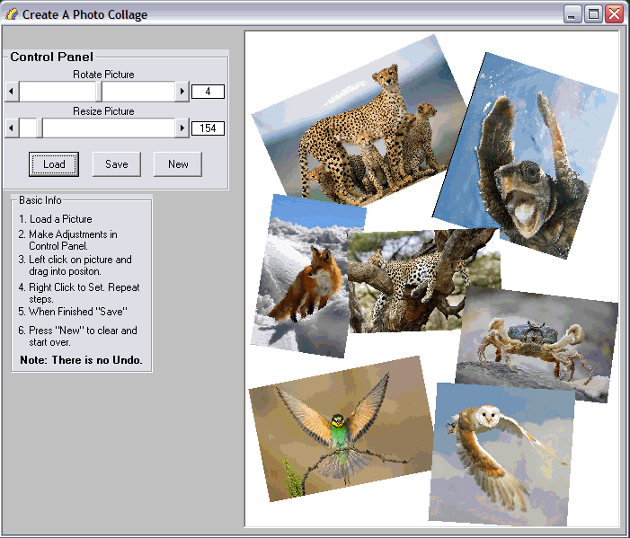



## Create A Photo Collage \(Update\)

### Description

This could be the start of a photo collage program. Fairly small amount of code.Things to add could be rotatiable text, templates, or background patterns. Can only save as bitmap at the present.(Was too lazy to add the others) Hope you find it useful.

Update:Added Save Jpeg,add text and background, can undo now. Let me know what you think.

Update: add shapes.
 
### More Info
 

             |
---                |---
**Submitted On**   |2009-11-14 18:09:24
**By**             |[Kenneth Foster](https://github.com/Planet-Source-Code/PSCIndex/blob/master/ByAuthor/kenneth-foster.md)
**Level**          |Intermediate
**User Rating**    |4.7 (14 globes from 3 users)
**Compatibility**  |VB 6\.0
**Category**       |[Graphics](https://github.com/Planet-Source-Code/PSCIndex/blob/master/ByCategory/graphics__1-46.md)
**World**          |[Visual Basic](https://github.com/Planet-Source-Code/PSCIndex/blob/master/ByWorld/visual-basic.md)
**Archive File**   |[Create\_A\_P2169371252009\.zip](https://github.com/Planet-Source-Code/kenneth-foster-create-a-photo-collage-update__1-72627/archive/master.zip)

